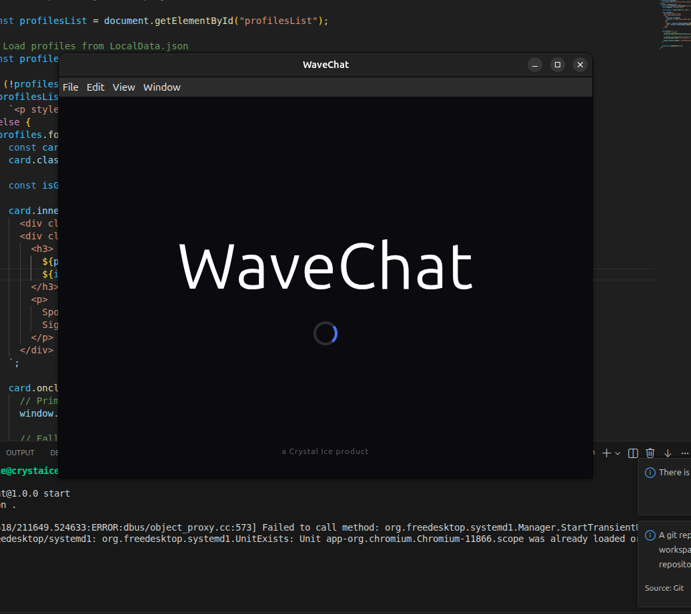
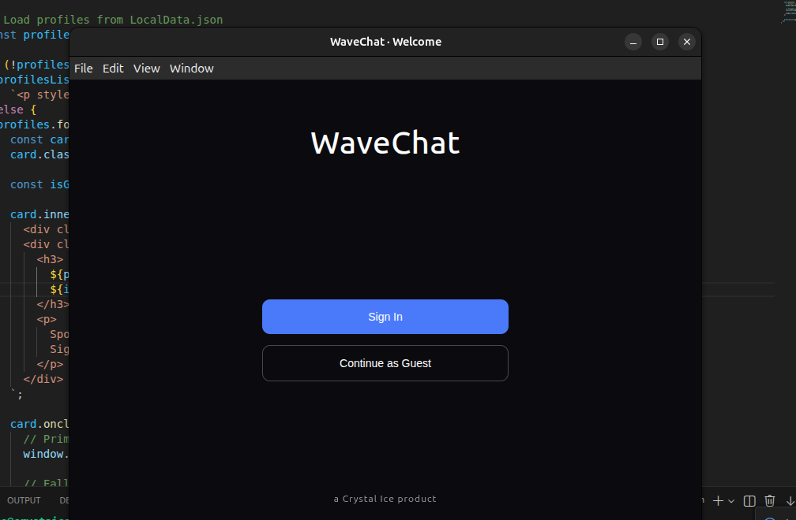
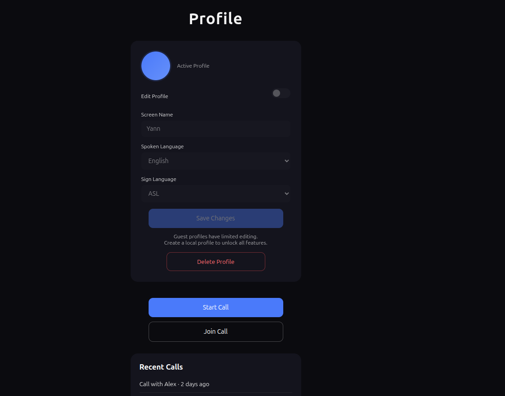
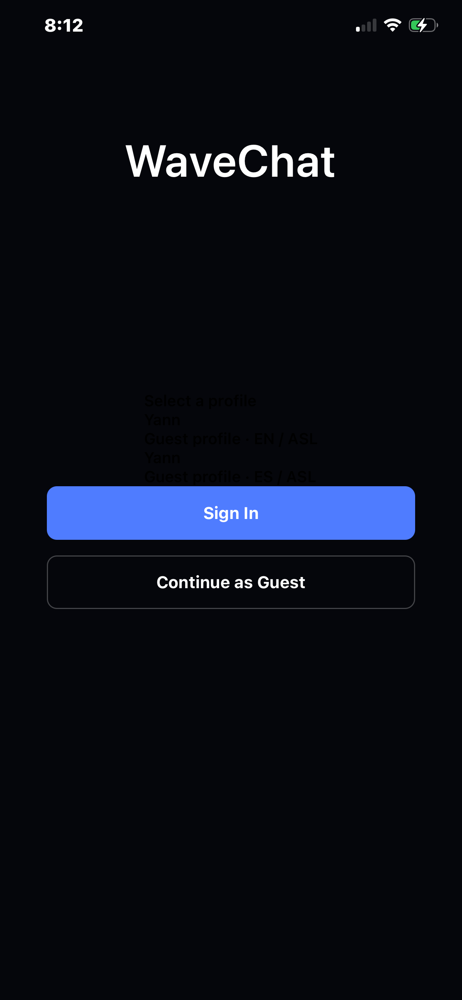
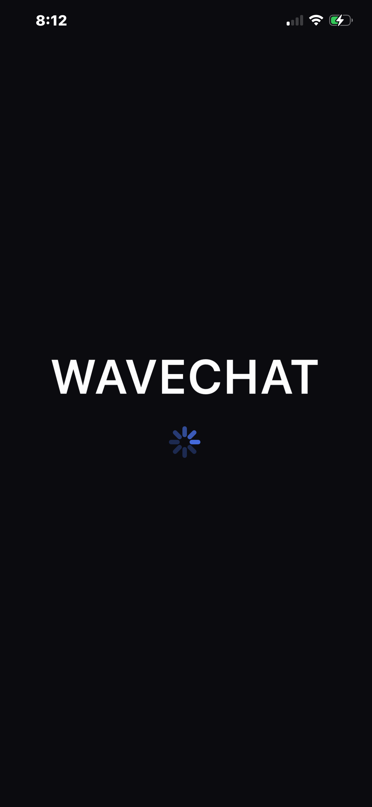

# WaveChat 👋

**Accessible real-time communication prototype for video calls, gesture detection, and future Deaf / Hard of Hearing communication tools.**

WaveChat is an experimental communication platform exploring how video chat, computer vision, and gesture-aware interfaces could make digital communication more accessible for Deaf and Hard of Hearing (DHH) users.

The project currently includes separate **desktop** and **mobile** prototypes. The desktop version focuses on real-time video calling, camera access, and early hand/face detection. The mobile version explores startup/onboarding flows and the foundation for a future cross-platform communication experience.

> Current status: early prototype / concept build. WaveChat does **not** yet provide complete sign-language translation. The current work demonstrates UI flow, video communication concepts, camera access, and early gesture/face detection experiments.

More on: [yannkabambi.com/wavechat](https://www.yannkabambi.com/wavechat)

---

## Project Goals

WaveChat was built around a simple idea:

> Communication tools should support more than typing and talking.

The long-term vision is a platform where users can communicate through:

- video calls
- chat
- typed messages
- gesture-aware input
- future sign-language recognition
- accessible cross-platform communication tools

---

## Current Prototype Status

### Desktop Prototype

The desktop prototype is built with Electron and React and explores:

- desktop video calling
- device camera access
- peer-to-peer communication concepts
- MediaPipe-based hand and face detection
- early gesture detection
- lobby / startup UI
- app-window desktop experience

Current progress:

- can connect to the device camera
- can create a simple call flow
- can detect faces and certain hand/gesture inputs
- includes early UI screens for startup and lobby states

### Mobile Prototype

The mobile prototype is built with React Native / Expo and explores:

- startup flow
- onboarding UI
- mobile-first interface direction
- future profile persistence
- future camera / communication integration

Current progress:

- early startup flow
- onboarding screens
- mobile UI concept
- profile persistence still in progress

---

## Prototype Screenshots

### Desktop App

| Startup Screen | Lobby / No User State | Sample User Test |
|---|---|---|
|  |  |  |

### Mobile App

| Mobile Startup / Onboarding | Mobile UI Concept |
|---|---|
|  |  |

---

## Architecture Overview

```txt
WaveChat
├── DeskTop/
│   ├── Electron shell
│   ├── React interface
│   ├── WebRTC video communication concept
│   ├── MediaPipe hand / face detection
│   └── desktop UI prototype images
│
└── mobile/
    ├── React Native / Expo prototype
    ├── mobile startup flow
    ├── onboarding UI concept
    └── mobile prototype images
```

---

## Technology Stack

### Desktop

- ElectronJS
- ReactJS
- WebRTC
- MediaPipe
- TensorFlow experimentation
- Firebase experimentation
- JavaScript / HTML / CSS

Built using a desktop app structure based on:

- [electron-react-app-template](https://github.com/Yannsean22/electron-react-app-template.git)

### Mobile

- React Native
- Expo
- WebRTC concept planning
- MediaPipe / TensorFlow experimentation
- Firebase experimentation

### Cloud / Future Direction

- Firebase
- WebRTC signaling
- user profiles
- session state
- accessibility-focused communication features

---

## What Works Today

This repository currently demonstrates:

- a desktop video communication prototype
- camera integration
- early hand / face detection
- early gesture-detection experiments
- desktop UI flow
- mobile startup/onboarding UI
- cross-platform project direction

---

## What Is Still In Progress

WaveChat is still an early-stage prototype. The following areas are not complete yet:

- full sign-language translation
- production-ready WebRTC signaling
- user accounts / authentication
- complete mobile camera flow
- stable profile persistence
- real-time translated output
- accessibility testing with real DHH users
- production deployment

---

## Why I Built It

WaveChat was built to explore how accessible communication could combine:

- real-time video
- computer vision
- gesture recognition
- chat
- cross-platform apps
- inclusive UX

The project also helped me build experience with Electron, React, React Native, WebRTC, MediaPipe, TensorFlow-style tooling, camera pipelines, and accessibility-focused software design.

---

## Repository Structure

```txt
WaveChat/
├── DeskTop/
│   ├── images/
│   ├── src/
│   ├── README.md
│   ├── index.html
│   ├── main.js
│   ├── preload.js
│   └── package.json
│
├── mobile/
│   ├── assets/
│   ├── images/
│   ├── src/
│   ├── App.js
│   ├── README.md
│   ├── app.json
│   ├── index.js
│   └── package.json
│
└── README.md
```

---

## Run / Setup

### Desktop

```bash
cd DeskTop
npm install
npm start
```

### Mobile

```bash
cd mobile
npm install
npx expo start
```

> Setup may require additional configuration depending on camera permissions, Firebase configuration, WebRTC setup, and local environment.

---

## Project Positioning

WaveChat is not presented as a finished accessibility product yet. It is a working concept and prototype that shows:

- real-time communication interest
- camera and computer vision integration
- cross-platform UI experimentation
- accessibility-focused product thinking
- early gesture-aware interface development

The goal is to keep improving the project toward a communication tool that could eventually support Deaf and Hard of Hearing users more naturally.

---

## Author

**Yann Kabambi**

- Portfolio: [yannkabambi.com](https://www.yannkabambi.com/)
- WaveChat page: [yannkabambi.com/wavechat](https://www.yannkabambi.com/wavechat)
- GitHub: [Yannsean22](https://github.com/Yannsean22)
- LinkedIn: [yann-kabambi](https://www.linkedin.com/in/yann-kabambi/)
